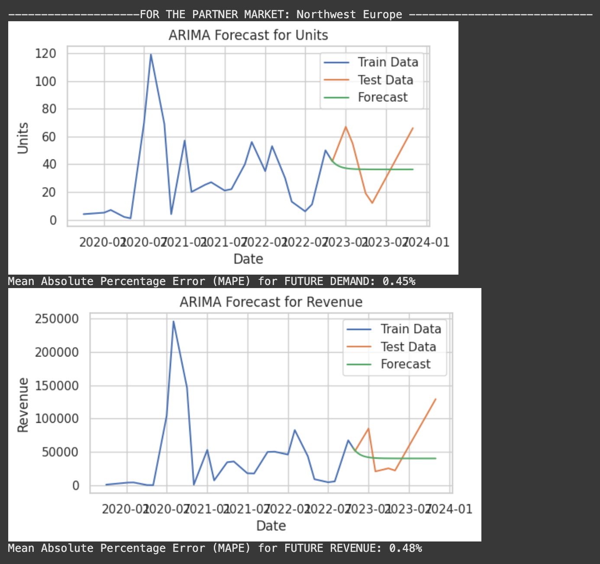
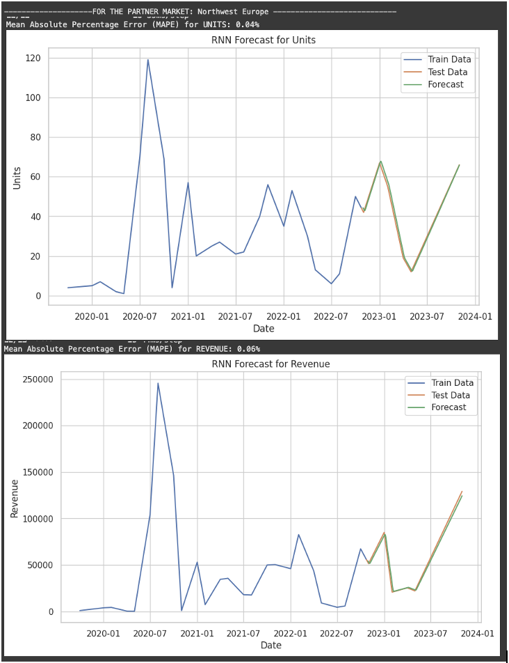
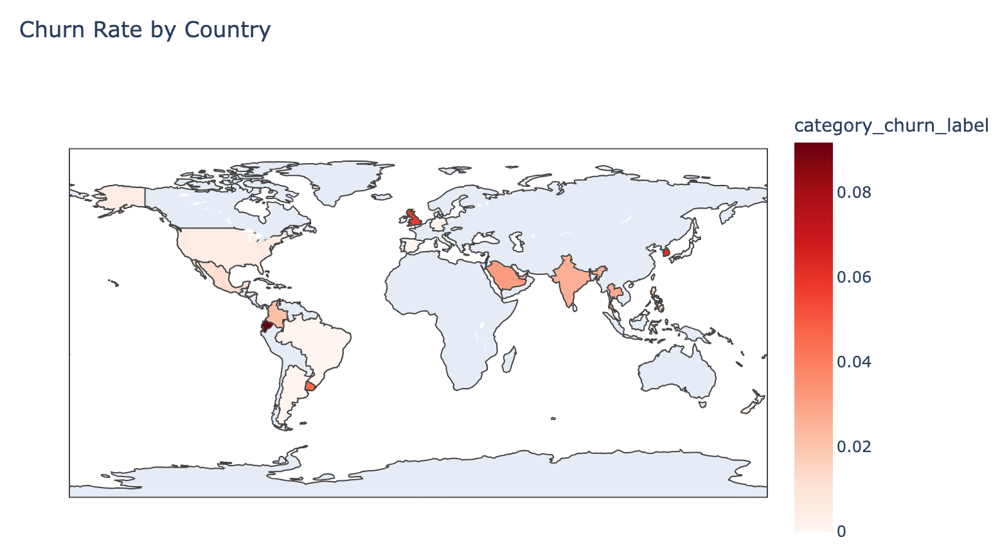
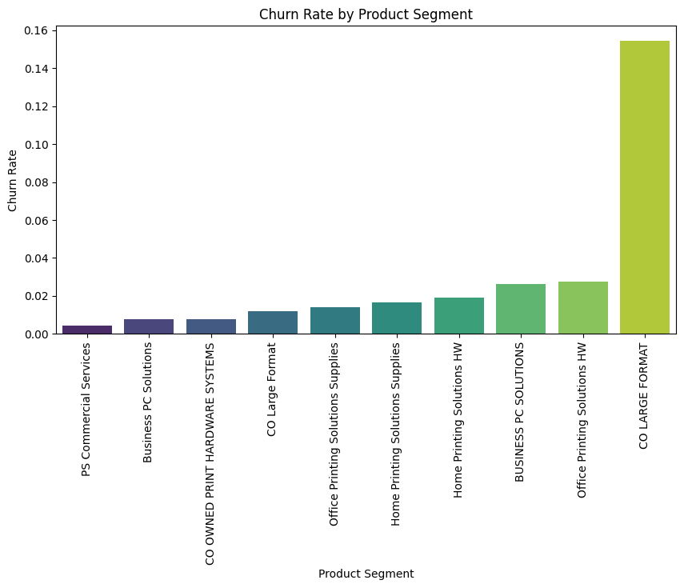

# 📊 Sales Forecasting & Customer Churn Prediction on Sales Data
A Business Data Management project for B.S. in Data Science & Applications Diploma at the Indian Institute of Technology Madras (IITM)

## 📌 Project Overview
This project analyzes **370,000 Sales records** to:
- **Segment customers and products** based on purchase behavior.
- **Predict future sales & revenue** using **ARIMA & LSTM models** (achieving <1% error).
- **Identify customer churn trends** using classification models.

## 🎯 Business Objectives
1. **Customer Segmentation**: Group customers by **product category and geographic region** to refine marketing strategies.
2. **Sales Forecasting**: Predict future **demand and revenue trends** to optimize **inventory management**.
3. **Customer Churn Prediction**: Identify potential **at-risk customers** and suggest retention strategies.

## 📊 Dataset Details
- **Source**: HP’s distributor-retailer-customer transaction data (4 years).
- **Size**: **370,000 records**.
- **Key Attributes**:
  - **Sales Information**: Revenue, units sold, purchase frequency.
  - **Product Hierarchy**: Business Unit → Product Group → Product Line.
  - **Customer Geography**: Partner Market (Continent), Partner Country.

## 🏗️ Data Preprocessing
1. **Cleaning**:
   - Removed irrelevant columns (IDs, currency types).
   - Replaced missing values using **interpolation**.
   - Standardized **date format** for time-series forecasting.

2. **Feature Engineering**:
   - Extracted top features using **Mutual Information Gain**.
   - Applied **Pareto Analysis (80/20 rule)** to find high-value products & regions.

3. **Balancing the Data**:
   - Addressed class imbalance in churn prediction using **SMOTE (Synthetic Oversampling)**.

---

## 🚀 Modeling Approach

### **1️⃣ Demand & Revenue Forecasting**
| Model | Purpose | MAPE (Error) |
|--------|---------|--------------|
| **ARIMA** | Time-series forecasting | **<25%** |
| **LSTM (Deep Learning)** | Capturing complex trends | **~0.8%** |

📌 **Results**:
- Printing Supplies generate the most revenue.
- SEMEA (Southern Europe, Middle East & Africa) has the **highest demand**.

### **2️⃣ Customer Churn Prediction**
| Model | Accuracy |
|--------|---------|
| **Logistic Regression** |  |
| **Random Forest** |  |
| **XGBoost** |  |

📌 **Findings**:
- **High-Churn Risk**: **.
- **Key Indicator**: **.

---

## 📈 Key Visualizations

### **Sales Forecasting Example (ARIMA Model)**

### **Revenue Forecasting Example (LSTM Model)**

### **Customer Churn by Country**

### **Customer Churn by Product Segment**

### **Customer Churn Prediction Performance**

---

## 🔍 Example Insights & Recommendations
1. **Target High-Value Segments**:
   - Focus on **Computing & Printing Hardware** (higher revenue per unit).
   - Prioritize **SEMEA & Central Europe** (largest buyers).

2. **Inventory Optimization**:
   - **Leverage LSTM Forecasting** for **accurate inventory management**.
   - Scale production in **Turkey** to serve **Europe & Middle East**.

3. **Churn Reduction Strategies**:
   - **Early Warning System**: Detect customers with **reduced purchase frequency**.
   - **Retention Offers**: Discounts for customers **approaching end-of-warranty**.

---
