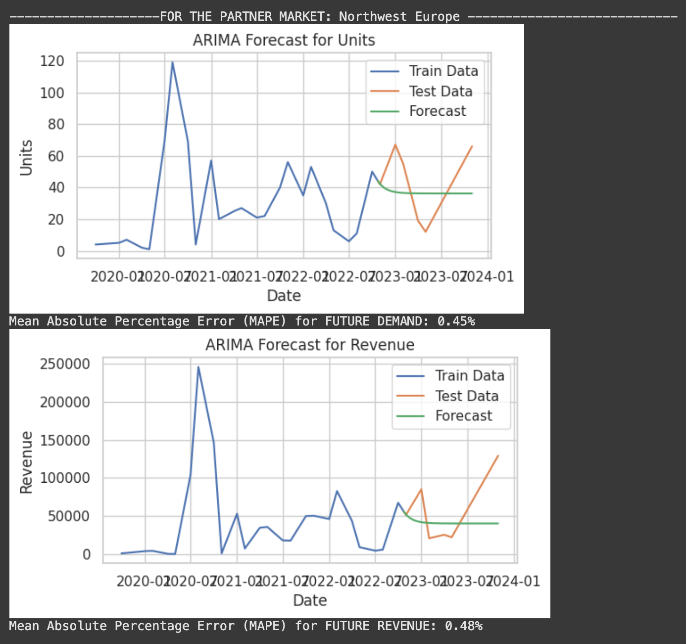
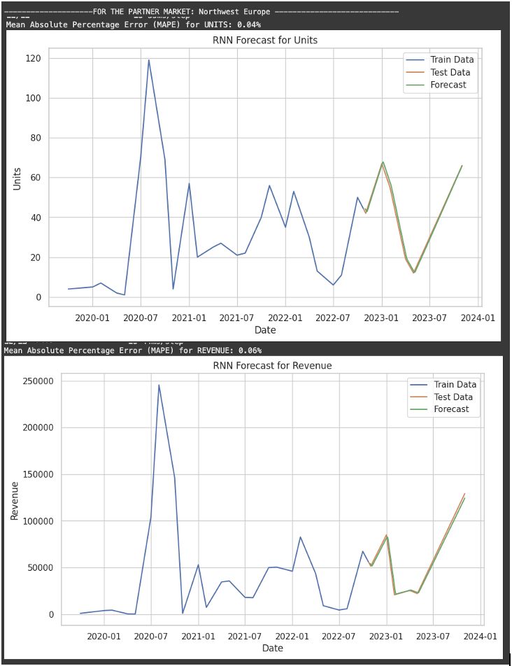
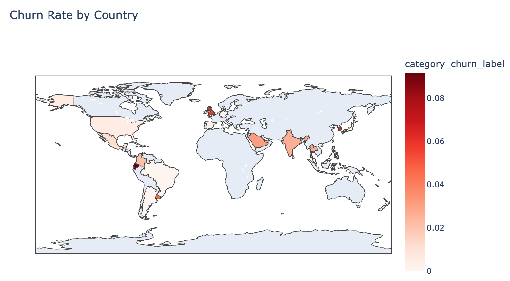
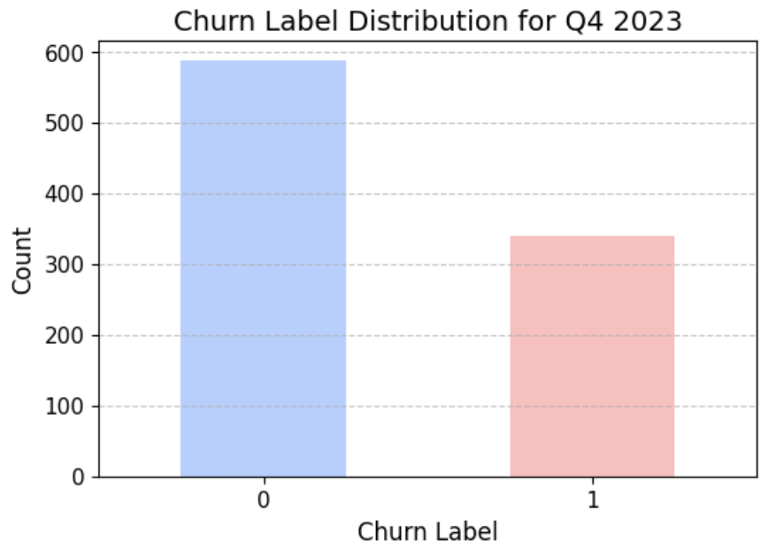
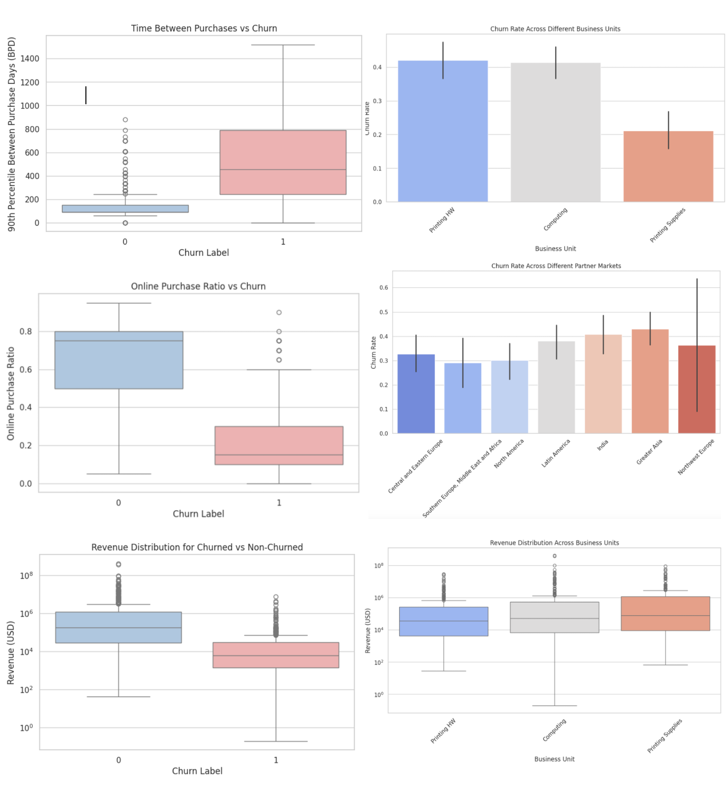
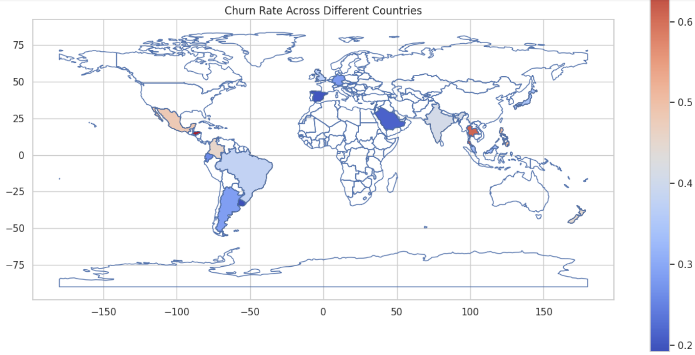
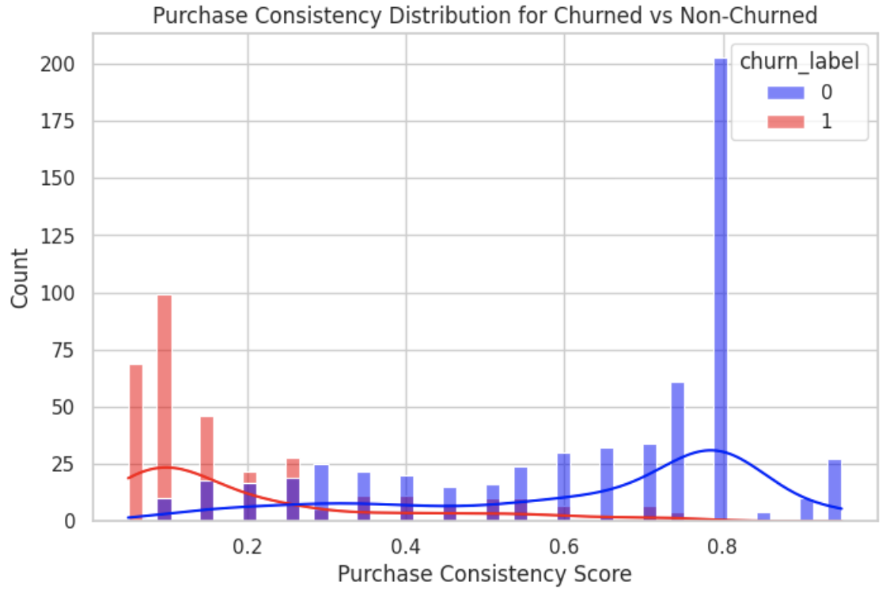
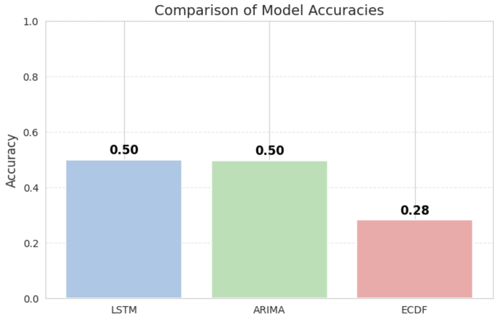
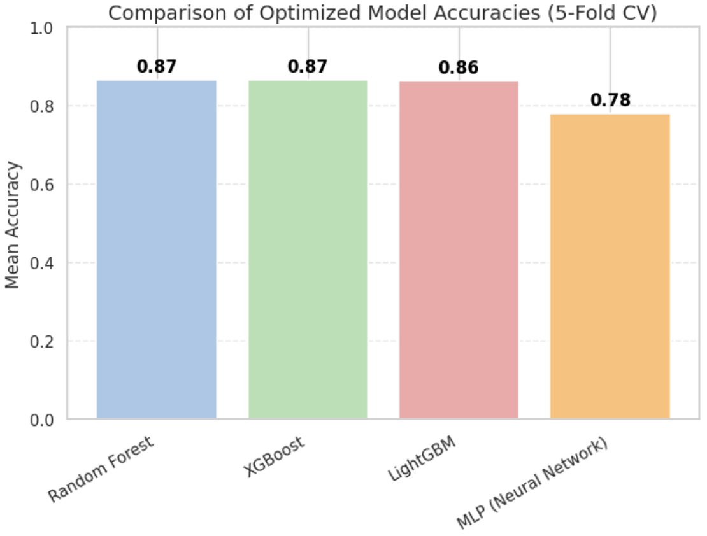

# 📊 Sales Forecasting & Customer Churn Prediction (On Non-Contractual settings) on Sales Data
A Business Data Management project for B.S. in Data Science & Applications Diploma at the Indian Institute of Technology Madras (IITM)

## 📌 Project Overview
This project analyzes **370,000 Sales records** to:
- **Segment customers and products** based on purchase behavior.
- **Predict future sales & revenue** using **ARIMA & LSTM models** (achieving <1% error).
- **Identify customer churn trends** using classification models.

## 🎯 Business Objectives
1. **Customer Segmentation**: Group customers by **product category and geographic region** to refine marketing strategies.
2. **Sales Forecasting**: Predict future **demand and revenue trends** to optimize **inventory management**.
3. **Customer Churn Prediction**: Identify potential **at-risk customers** and suggest retention strategies.

## 📊 Dataset Details
- **Source**: A printing compay's distributor-retailer-customer transaction data (4 years).
- **Size**: **370,000 records**.
- **Key Attributes**:
  - **Sales Information**: Revenue, units sold, purchase frequency.
  - **Product Hierarchy**: Business Unit → Product Group → Product Line.
  - **Customer Geography**: Partner Market (Continent), Partner Country.

## 🏗️ Data Preprocessing
1. **Cleaning**:
   - Removed irrelevant columns (IDs, currency types).
   - Replaced missing values using **interpolation**.
   - Standardized **date format** for time-series forecasting.

2. **Feature Engineering**:
   - Extracted top features using **Mutual Information Gain**.
   - Applied **Pareto Analysis (80/20 rule)** to find high-value products & regions.

3. **Balancing the Data**:
   - Addressed class imbalance in churn prediction using **SMOTE (Synthetic Oversampling)**.

---

## 🚀 Modeling Approach

### **1️⃣ Demand & Revenue Forecasting**
| Model | Purpose | MAPE (Error) |
|--------|---------|--------------|
| **ARIMA** | Time-series forecasting | **<25%** |
| **LSTM (Deep Learning)** | Capturing complex trends | **~0.8%** |

📌 **Results**:
- Printing Supplies generate the most revenue.
- SEMEA (Southern Europe, Middle East & Africa) has the **highest demand**.

### **2️⃣ Customer Churn Prediction**
| Model | Accuracy |
|--------|---------|
| **Logistic Regression** |  |
| **Random Forest** |  |
| **XGBoost** |  |

📌 **Findings**:
- **High-Churn Risk**: **.
- **Key Indicator**: **.

---

## 📈 Key Visualizations

### **Sales Forecasting Example (ARIMA Model)**

### **Revenue Forecasting Example (LSTM Model)**

### **Customer Churn by Country**

### **Customer Churn Prediction Performance**

---

## 🔍 Example Insights & Recommendations
1. **Target High-Value Segments**:
   - Focus on **Computing & Printing Hardware** (higher revenue per unit).
   - Prioritize **SEMEA & Central Europe** (largest buyers).

2. **Inventory Optimization**:
   - **Leverage LSTM Forecasting** for **accurate inventory management**.
   - Scale production in **Turkey** to serve **Europe & Middle East**.

3. **Churn Reduction Strategies**:
   - **Early Warning System**: Detect customers with **reduced purchase frequency**.
   - **Retention Offers**: Discounts for customers **approaching end-of-warranty**.

---

# 🔄 Customer Churn Prediction for a Printing Company (Non-Contractual Basis)

## 📌 Project Overview
This project aims to predict **customer churn** for a **printing company** using **sales transaction data (2018-2022)**. The objective is to:
- Identify **customers likely to churn** in 2023.
- Compare different **churn prediction methodologies**:
  - **Forecasting models** (ARIMA, LSTM)
  - **Empirical distribution-based method (ECDF)**
  - **Machine Learning (XGBoost, Random Forest)**

---

## **🗂️ Dataset**
- **Source**: Sales transaction data (370,000 records from 2018-2022).
- **Prediction Window**: Train on **2018-2022**, test on **Q4 2023**.
- **Key Features**:
  - **Customer ID - Product ID**: Unique combination treated as a "customer."
  - **Transaction history**: Purchase trends over time.
  - **Revenue & Purchase Frequency**: Key indicators of customer engagement.

📌 **Data Preprocessing Steps**
1. **Consolidated data into fiscal and calendar quarters** to ensure continuity.
2. **Aggregated transactions per Customer ID - Product ID combination**.
3. **Feature Engineering**:
   - Purchase frequency & recency
   - Churn probability indicators
4. **Feature Reduction** using **Random Forest feature importance**.

---

## **🛠️ Model Architectures**
### **1️⃣ Forecasting-Based Churn Detection**
| Model | Method | Accuracy |
|--------|------------------|------------|
| **ARIMA** | Forecasts future revenue for each customer. If **3 consecutive quarters** have **zero revenue**, it's classified as churned. | **50%** |
| **LSTM** | Uses deep learning for time-series forecasting. Same churn rule as ARIMA. | **50%** |

📌 **Findings**:
- Both **ARIMA & LSTM underperformed (50% accuracy)**.
- **Time-series models alone are insufficient** for churn prediction.

---

### **2️⃣ Empirical Cumulative Distribution Function (ECDF) Approach**
| Method | Definition | Accuracy |
|--------|------------|------------|
| **ECDF** | Customers in the **lowest 10% revenue percentile** are classified as churned. | **28%** |

📌 **Findings**:
- **ECDF method is not reliable for churn detection**.
- It **overclassifies churned customers**, leading to low accuracy.

---

### **3️⃣ Machine Learning-Based Churn Prediction (Best Model)**
| Model | Accuracy | Precision | Recall |
|--------|---------|-----------|--------|
| **Random Forest** | 87% | 0.86 | 0.88 |
| **XGBoost (Best Model)** | **87%** | **0.89** | **0.90** |
| **LightGBM** | 86% | 0.85 | 0.87 |
| **MLP (Neural Network)** | 78% | 0.76 | 0.80 |

📌 **Key Findings**:
- **XGBoost outperformed all other methods (87% accuracy).**
- **ECDF, ARIMA, and LSTM performed poorly** for non-contractual churn detection.
- **Machine Learning models were most effective** for prediction.

---

## **📊 Exploratory Data Analysis (EDA)**
### **Customer Churn Distribution**

### **Customer Churn Distribution and Churn Rate Across Business Units Analysis**

### **Churn Rate by Country**

### **Purchase Consistency Score vs Churn**

📌 **Insights**:
- Customers with **lower purchase consistency** have **higher churn probability**.
- **Printing Supplies customers churn less** than those in **Printing HW**.
- **Churn rates vary significantly by region**.

---

## **📈 Model Performance Comparison**
### **Forecasting Models (ARIMA & LSTM and ECDF)**

### **Machine Learning Models (XGBoost, RF, LightGBM)**

📌 **Key Insights**:
- **Time-series forecasting alone is not enough** for churn prediction.
- **Machine Learning (XGBoost) works best** in non-contractual churn settings.

---

## **🔍 Conclusion**
✅ **Best Model: XGBoost (87% accuracy)**.  
❌ **ARIMA, LSTM, and ECDF-based methods performed poorly**.  
🔄 **Next Steps**:
- Explore **deep learning-based classifiers** (e.g., Transformer-based models).
- Optimize feature selection & ensemble approaches.
